<!-- hero: extruded 3d ascii wordmark (wipes in left-to-right, then rocks on
     its vertical axis) beside a neofetch-style info card whose lines slide in.
     wordmark:  python scripts/make_wordmark_svg.py --mode rock --out wordmark.svg
     info card: python scripts/make_info_card.py -->

<h3><code>kermito21@github ~ $ whoami</code></h3>

 
 

<h3><code>kermito21@github ~ $ neofetch</code></h3>

 
 

<!-- animated contribution graph: real data, boxes pop in cell by cell
     (regenerated daily by .github/workflows/update-profile-art.yml) -->

<h3><code>kermito21@github ~ $ ./contributions.sh</code></h3>

 
 

<h3><code>kermito21@github ~ $ ./links.sh</code></h3>

<!-- add more badges here, e.g.

-->

 

